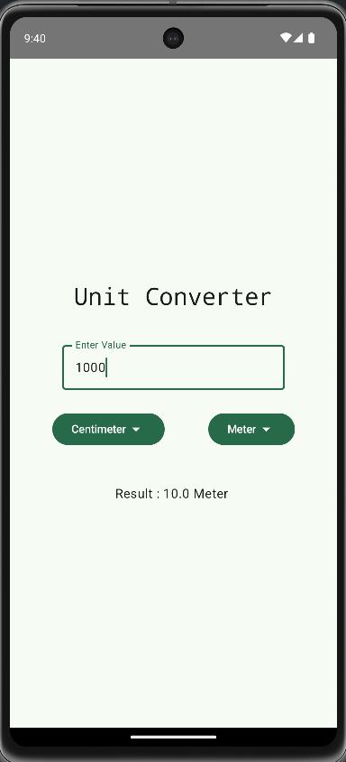

# UnitConverter
UnitConverterApp is a simple and efficient application designed to convert various units of measurement. Whether you need to convert length, weight, volume, or temperature, this app provides a seamless experience for quick and accurate conversions.

# Features
- Length Conversion: Convert between meters, centimeters, feet, inches, and more.
- Weight Conversion: Convert between kilograms, grams, pounds, ounces, and more.
- Volume Conversion: Convert between liters, milliliters, gallons, cups, and more.

# Preview

